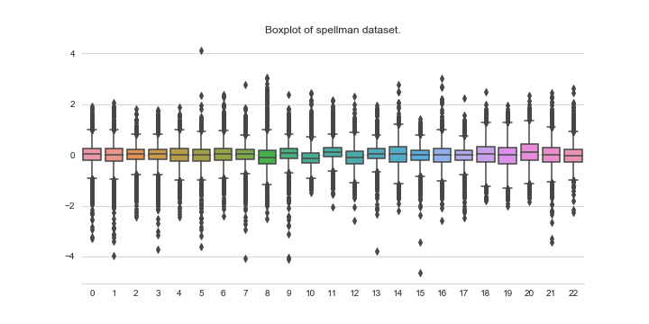
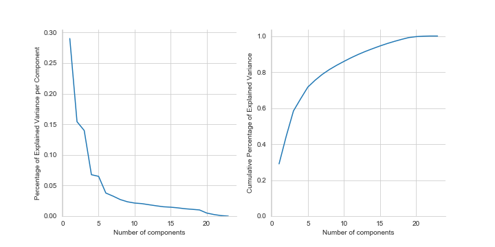
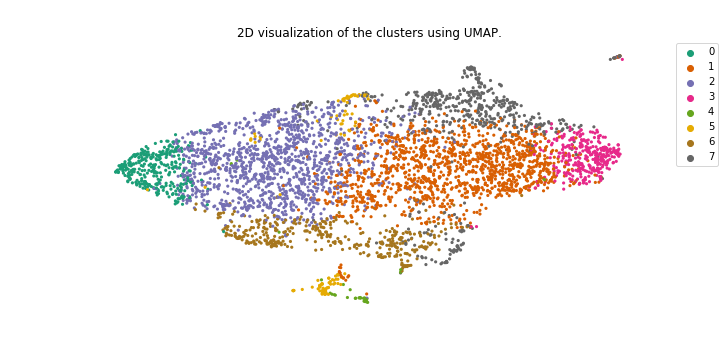

<h2> Single Cell Identification Project</h2>

Provides a platform which eases the process of identifying cell types given a gene expression matrix.
The following features have been implented so far.

<ul>
    <li>Data Exploration: Boxplot. </li> 
    <li>Variance Ratio Plotting:PCA </li> 
    <li>2D and 3D visualization of the data: UMAP, PCA, t-SNE. </li> 
    <li>Dimensionality reduction: PCA.</li> 
    <li>Clustering: k-Means, Spectral Clustering.</li> 
</ul>