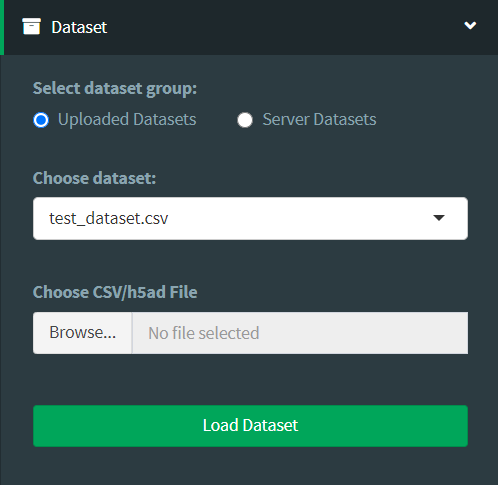

## README

Documentation for the single cell analysis app hosted by the Bar-Joseph [Systems Biology group](http://www.sb.cs.cmu.edu/) at Carnegie Mellon University accessible [here](https://data.test.hubmapconsortium.org/app/cellar).

---

### Choose dataset

In this tab, users can either upload their own single cell gene expression data
as a _csv_ or _h5ad_ file, with rows corresponding to cells and columns corresponding
to genes. For gene ids, please make sure they are either in _HGNC_, _entrez ID_, or _ENSEMBL_ format.

Clicking the **Load Dataset** button loads the dataset into the app for use.

---

### Clustering

---

### Label Transfer

---

### Selection and Labelling

---

### Analysis

---

### Appearance

---

### Saving and Loading sessions
