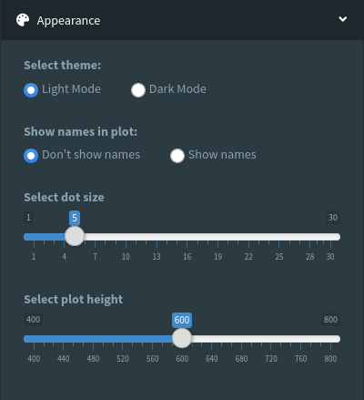

## Cell Type Annotation Robot (Cellar) User Guide

Documentation for the single cell analysis app hosted by the Bar-Joseph [Systems Biology group](http://www.sb.cs.cmu.edu/) at Carnegie Mellon University, accessible [here](https://data.test.hubmapconsortium.org/app/cellar).

### Table of Contents
**[Layout](#layout)** 
**[Dataset](#dataset)** 
**[Clustering](#clustering)** 
**[Label Transfer](#label-transfer)** 
**[Selection and Labeling](#selection-and-labeling)** 
**[Analysis](#analysis)** 
**[Appearance](#appearance)** 
**[Export Import](#export-import)** 
**[Examples](#examples)** 

### Layout

The above image shows the default layout of cellar. The sidebar menu is on the left, with panels enabling users to do various analysis as well as configure various settings.

On the right is the main body, which shows the results of the analysis. The top of the body is the main plot, visualizing the 2d embeddings of the cells being analyzed. The colors can represent the clusters of the cells or the gene expression level of any selected gene, which can be changed in the analysis panel. When the expression level is shown, shapes of the points represent the clusters they belong to.

The button "view cluster names" controls the collapsible table showing the user assigned names for each cluster and subset of cells. Detailed illustration of assigning names operation is in the "selection & labeling" section.

The bottom of the body shows the results of various analysis, such as GO and KEGG.

### Dataset

**Select dataset group** : Under `Uploaded Datasets` the user will find all of their uploaded datasets. Under `Server Datasets` the user will find a list of datasets provided by cellar and collected from different sources.

**Choose Dataset** : Choose the desired dataset from the corresponding group.

**Choose CSV/h5ad file** : Upload a dataset. The accepted formats for the dataset are `h5ad` or `csv` (rows are cells, columns are genes). For gene ids, please make sure they are either in _HGNC_, _entrez ID_, or _ENSEMBL_ format.

**Load Dataset** : Loads the dataset from memory. Must be run before any analysis can take place.

---

### Clustering

**Run with current configuration** : To be run after the user has selected the desired settings below.

**Dimensionality reduction** : Choose the desired method to use for dimensionality reduction. The reduced embeddings will be used in the clustering step.

**Number of components** : Specify the number of components to use for the selected dimensionality reduction method. Can be either Automatic (only for `PCA`) or Manual. In case of PCA/Automatic, the ankle heuristic on the explained variance graph will be used. By default, the app will search the data file for any previously existing embeddings of the same method and number of components. If found, will return those instead. This can speed up the computation immensely.

**Clustering** : Choose the clustering algorithm to use on the reduced data.

**Number of clusters** : Specify the number of clusters to use for the selected clustering algorithm (if applicable). This can be a single integer, a list of comma-separated values, or a tuple specifying a range. E.g., if user inputs `(4, 16, 1)`, then the app will run the selected clustering algorithm with a number of clusters ranging from 4 to 16 in increments of 1.

**Evaluation** : In case the number of clusters as specified earlier is a list or a range, then this evaluation method will be used to determine the number of clusters which achieved the highest score.

**Visualization Method** : Choose the visualization method that will be used to create 2D embeddings for plotting purposes.

**Constrained clustering** : Choose the constrained clustering algorithm to run. This requires existing labels and is mainly used to refine existing clusters after the user has manually modified them.

**Clusters to preserve** : If applicable, these clusters (as specified by their ID) will be preserved by the constrained clustering algorithm.

**Run constrained clustering** : Can only be run if there is a plot available. Run the selected constrained clustering method.

**Clusters to merge** : Merge the desired clusters into a single one. This single cluster inherits the label of the first cluster in the list.

---

### Label Transfer

**Select label transfer method** : Choose the method to run label transfer. This uses an annotated reference dataset to annotate the currently active dataset.

**Choose reference dataset (h5ad)** : Upload the reference dataset. Must be in h5ad format and must have the 'labels' key populated.

---

### Selection and Labeling

This tab allows users to annotate clusters, add new clusters, and select a preferred cell type for the clusters using the provided cell ontology labels. These tasks can be split into several groups:

    1. Store a subset of cells to use for downstream analysis
    2. Add new labels (cell types)
    3. Change the label of a cluster or subset

Task 1:

**New Subset** : Enter the subset name for the currently selected cells.

**Add Subset** : Store the new subset.

Task 2:

**New label** : Enter the name of a new label.

**Add Label** : Add the label to the list.

Task 3:

**Select tissue** : Select the tissue that the cell subset belongs to. User defined labels can be found under the "user defined" option.

**Select cell type** : The cell types in the selected tissue will be in the choice list.

**Choose subset** : Select the cell subset or cluster you want to update.

**Update Subset Labels** : Update the selected subset with the selected cell type.

---

### Analysis

**View gene expression** : Show the expression level of the selected gene. When "Clusters" is selected, the clusters are shown instead.

**Select number of genes** : Lets users define the maximum number of DE genes that are used in the differential expression analysis. The returned number of genes may be lower than this value if they were not found to be significant.

**alpha** : The cut-off for p-values.

**Correction** : The correction method to use for p-values. If no correction is desired, choose `None`.

**Choose subset 1 & 2** : Choose the subsets to use in the DE gene analysis. Selecting "None" uses all the cells but those in the other subset.

**Run DE analysis** : Calculate DE genes of Subset1 (vs. Subset2).

**Search Gene card** : Enter the gene name you want to search for (opens a new tab to genecards.org).

After finishing DE analysis, the DE panel of the bottom of the UI body will show the results. Other panels will also be activated for subsequent analysis.

---

### Appearance

**Select theme** : Change the theme to Light or Dark mode. Sometimes gene expression values/clusters may be seen clearly in Dark mode.

**Show names in plot** : Show or hide cluster labels in the main plot.

**Select dot size** : Select the size of the points in the main plot.

**Select plot height** : Select the height of the plot.

---

### Export Import

**Export Session** : Download the current session in an h5ad file.

**Import Session** : Upload a session and load it.

**Select format** / **Download plot** : Converts the plot to the specified file format and downloads it.

**Input Subset IDs** / **Download Selected Subsets** : Enter the subset IDs you want to download. For example 1,2,5 means downloading subsets 1,2 and 5.

---

### Examples

#### Plot Example

#### DE genes Example

#### Expression for the most significant gene of Cluster 0 (green)

#### GO Analysis Example

#### Heatmap Example

