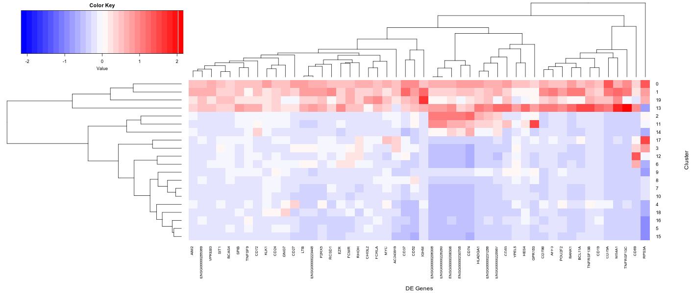

## README

Documentation for the single cell analysis app hosted by the Bar-Joseph [Systems Biology group](http://www.sb.cs.cmu.edu/) at Carnegie Mellon University accessible [here](https://data.test.hubmapconsortium.org/app/cellar).

---

### Table of Contents
**[The Overall Layout](#the-overall-layout)**<br>
**[Choose Dataset](#choose-dataset)**<br>
**[Clustering](#clustering)**<br>
**[Label Transfer](#label-transfer)**<br>
**[Selection and Labelling](#selection-and-labelling)**<br>
**[Analysis](#analysis)**<br>
**[Appearance](#appearance)**<br>
**[Exporing and Importing](#exporting-and-importing)**<br>

---
### The Overall Layout


The above image show the layout of our single cell analysis app.

On the left is the sidebar menu, with toggle panels enabling users to do various analysis as well as configure various settings, which will be elaborated later on.


On the right is the main body, which shows the results of the analysis. The top of the body is the main plot visualizing the cells being analyzed. The colors can represent the clusters of cells  or the gene expression level of any selected gene, which can be changed in the analysis panel. For example the expression level of the gene IL7R is shown in the above plot. When the expression level is shown, shapes of the points represent the clusters they belong to.

The button "view cluster names" controls the collapsible table showing the user assigned names for each cluster and subset of cells. Detailed illustration of assigning names operation is in the "selection & labeling" section.


The bottom of the body shows the results of various analysis that users can do, which will be elaborated in the "analysis" section.

The subsequent sections will introduce the functions in the sidebar panels.

---

### Choose Dataset


In this tab, users can either upload their own single cell gene expression data
as a _csv_ or _h5ad_ file, with rows corresponding to cells and columns corresponding
to genes. For gene ids, please make sure they are either in _HGNC_, _entrez ID_, or _ENSEMBL_ format.

Clicking the **Load Dataset** button loads the dataset into the app for use.

---

### Clustering


The **Run with current configuration** button is to be clicked after the user has selected the desired clustering parameters below, or is satisfied the provided defaults.

- **Dimensionality reduction** : Enables user to choose the method to reduce dimensions prior to clustering.

- **Number of components** : Enables the user to either manually choose the number of components after dimensionality reduction that clustering is carried on, or choose automatic to let the program choose optimal number of components based on explained variance.

- **Clustering** : Enables the user to choose the clustering algorithm.

- **Number of clusters** : Enables the user to choose the number of clusters they wish the data to correspond to.

- **Evaluation** :

- **Visualization Method** :

The following methods are for constrained clustering, which is done after ?

- **Constrained clustering**

- **Clusters to preserve**

- **Clusters to merge**

---

### Label Transfer


---

### Selection and Labelling


This tab allows users to annotate clusters, use the lasso on the plot to add user defined clusters, and select a preferred cell type for the clusters using provided cell ontology labels. These tasks can be split as:

1. Selecting a group of cells and make them a new subset
2. Adding a new label for cells
3. Changing the label (cell type) of any defined subsets

For 1:

- **New Subset** : Input the name for the new subset.

- **Add Subset** : After selecting a group of cells in the main plot isong the lasso and entering the new subset name, clicking this button will define a new subset.

For 2:

- **New label** : Input the name of new label.

- **Add Label** : Clicking after entering the new label name will add the label name into the choice list.

For 3:

- **Select tissue** : Select the tissue that the cell subset belongs to. User defined labels are in the "user defined" option.

- **Select cell type** : The cell types in the selected tissue will be in the choice list.

- **Choose subset** : Select the cell subset you want to update.

- **Update Subset Labels** : Update the selected subset with the select cell type.


---

### Analysis


Users can do various analysis including differentially expressed genes (DE genes) analysis in this panel.

- **View gene expression** : Let the colors in the plot show the expression level of the selected gene. When "Clusters" is selected, the colors show different clusters.

- **Select number of genes** : Lets users define the number of top DE genes that are used in the analysis for the heatmap, or any of the following ontology tabs. If the number of DE genes is less than this number, then all the DE genes are used.

- **alpha** :

- **Correction** :

- **Choose subset 1&2** : Choose the subsets you want to do DE gene analysis. Selecting "None" means selecting all the cells but those in the other subset.

- **Run DE analysis** : Calculate DE genes of Subset1 (vs. Subset2)

- **Search Gene card** : Enter the gene you want to search.

- **Search Card** : Clicking the button will open the gene card website of the entered gene.

After finishing DE analysis, the DE panel of the bottom of the UI body will show the results. Other panels will also be activated for subsequent analysis.

- **DE** :

  

	Shows the list of DE genes, arranged by their _logFC_

- **heatmap** :

  

	Shows heatmap of average expression of DE genes across all clusters. Both genes and clusters are clustered using heirarchical clustering.

- **Gene Ontology** :

  

	This tab shows the results of the hypergeometric test intersection of the DE genes with genes in each curated GO term. The option exists for users can download the entire table as a csv.

- **KEGG** :

  

	Similar to GO

- **MsigDB C2** :

  

	Similar to GO

- **Cell Type** :

  

	Similar to GO, but using cell type specific marker genes.

- **Disease** :

  

	Similar to GO

- **User Markers** :

  

	This tab allows the user to upload a list of marker genes, which should be in `json` format. for example, the json snippet below gives us 3 terms, _B cell, Cancer stem cell,_ and _T cell_.

	```
	{
    "B cell": [
      "CD79A"
    ],
    "Cancer stem cell": [
      "CD44",
      "CD24",
      "NES",
      "PROM1",
      "ALDH1A1"
    ],
    "T cell": [
      "CD4",
      "CD3G",
      "CD8A",
      "CD3E",
      "CD3D"
    ]
  }
	```
---

### Appearance


This panel enable the users to adjust the appearance of the main plot.

- **Select theme** : Change the UI body to Light/Dark mode.

- **Select dot size** : Select the size of the dots in the main plot.

- **Choose subset** : Select whether showing the cluster names or only IDs in the plot.

- **Choose subset** : Select the height of the plot.

---

### Exporing and Importing


This panel enables users to do the following:
1. Exporting the current session and import later for subsequent analysis or sharing the analysis results
2. Importing session after loading the dataset
3. Downloading the main plot.
4. Downloading a csv file including cell IDs with corresponding labels.

For 1:
- **Export Session** : Download the current session.

For 2:
- **Import Session** : Upload a session and load it.

For 3:
- **Select format** : Select which format of the plot to download.
- **Download Plot** : Download the plot.

For 4:
- **Input Subset IDs** : Enter the subset IDs you want to download. For example 1,2,5 means downloading subsets 1,2 and 5.
- **Download Selected Subsets** : Download subsets entered above together with their labels as a csv file.
