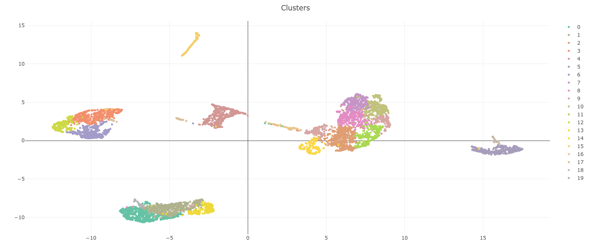

*******************************************
Cell Annotation Robot (cellar) Python guide
*******************************************
In addition to the interface provided in
`<https://data.test.hubmapconsortium.org/app/cellar/>`_,
cellar can also be used as a standalone python library,
although its functionality is more limited.
Here we provide a quick tour of the main components
and describe how to extend existing methods.

.. contents::

Installation
____________

To get started, you can install cellar using pip by running
the following command (requires Python >=3.7)

.. code:: bash

    $ pip install git+https://github.com/ferrocactus/cellar

This will install any required dependencies including popular
frameworks such as `numpy`_, `scikit-learn`_, `pandas`_ and more.
For a full list see `py_requirements`_.

You can test the installation by running the following simple snippet

.. code:: python

    import cellar as cl

    adata = cl.load_file('default')

    cl.reduce_dim(adata)
    cl.cluster(adata)
    cl.reduce_dim_vis(adata)
    cl.plot(adata)

This simple snippet also demonstrates the most basic pipeline
that you can run. Essentially, after loading the data (normalized)
into an `AnnData`_ object, we reduce the dimensionality
of the data (default: `PCA`_), followed by a clustering algorithm
(default: `Leiden`_) and a dimensionality reduction method for visualization
(default: `UMAP`_). Finally, we plot the results using `Plotly`_ (this will
open a new web page in your default browser).

Available Units
_______________

The following units are available in the python version of cellar:

* ``cl.reduce_dim``: depending on the chosen method, it performs a linear or a non-linear mapping of the data to a lower dimensional space.
* ``cl.cluster``: clusters the reduced data into a number of clusters as specified by the user, or as automatically detected using an evaluation method.
* ``cl.reduce_dim_vis``: further reduces the dimensionality of the data into 2D embeddings used for visualization.
* ``cl.name_genes``: finds and stores synonyms for gene ids (e.g., genes provided in ensembl format get converted to gene names).
* ``cl.de``: runs differential expression for a given subset of the data vs the rest or another subset.
* ``cl.ss_cluster``: runs a semi-supervised clustering algorithm. Useful when clusters have been modified by the user, and the user wishes to refine them.
* ``cl.transfer_labels``: given a reference labeled dataset, use that to transfer the labels into another dataset using the method specified.
* ``cl.plot``: plots the 2D embeddings colored by cluster, or colored by the expression value of a gene.

Some additional tools that we include here for completeness are:

* ``cl.load_file``: given a filepath, loads a dataset into an AnnData object.
* ``cl.store_subset``: given a list of indices, store it as a named subset.
* ``cl.store_labels``: set the labels field. It is recommended to use this function instead of manually updating the ``adata.obs['labels']`` entry.
* ``cl.update_subset_label``: set the cell type for the given subset.
* ``cl.populate_subsets``: after manually updating the cluster structure, run this to resolve subset/naming issues.
* ``cl.merge_clusters``: merge two or more clusters into a single one.

Usage
_____

The main structure used by cellar is the `AnnData`_ object.
While it is possible to call some of the units using a numpy array
or a list, it is recommended to use an AnnData object since it is
easier to maneuver the pipeline and more information is stored in
the object. To load a dataset you can either use ``cl.load_file``
or use the ``anndata`` read functionality as explained in
`<https://anndata.readthedocs.io/en/stable/api.html#reading/>`_.
We provide a test dataset borrowed from the Allen Brain Atlas
at `<https://human.brain-map.org/static/download/>`_ that you can
access by running

.. code:: python

    adata = cl.load_file('default')

**We assume the dataset is normalized.** We have decided to keep the
normalization part out of the package for now, so the user is free
to choose and apply any available normalization methods before feeding
their data into our pipeline.

Dimensionality Reduction
~~~~~~~~~~~~~~~~~~~~~~~~

After acquiring and loading the normalized data, typically the first
step is to reduce the dimensionality. PCA is the most popular choice
which applies a linear map to a lower dimensional space where each
dimension tries to preserve as much of the variance as possible.
To see a full list of what methods are available consult
https://github.com/ferrocactus/cellar/blob/master/doc/methods.rst#dimensionality-reduction.

To choose a method simply pass its name to the method parameter as

.. code:: python

    cl.reduce_dim(adata, method='PCA', n_components=20)

Any parameter that is listed in the method's web page can also be passed
down to ``cl.reduce_dim``. For example, if one wishes to use ``svd_solver='arpack'``
in scikit-learn's implementation of PCA, you simply need to run

.. code:: python

    cl.reduce_dim(adata, method='PCA', n_components=20, svd_solver='arpack')

If ``n_components='knee'``, then we compute the explained variance graph
with a high number of components (default: 200), and then use the knee detector
algorithm of https://github.com/arvkevi/kneed to find the number of
components (minimum: 10) that corresponds to the 'knee' of the plot.

Unless specified otherwise, ``cl.reduce_dim`` will populate the
``adata.obsm['x_emb']`` key and more information will be stored in
``adata.uns['dim_reduction_info']``.

Clustering
~~~~~~~~~~

The default clustering method is 'Leiden', although more methods
are available as listed in
https://github.com/ferrocactus/cellar/blob/master/doc/methods.rst#clustering.
Similar as before, the
desired method can be changed by passing the its name to
the method parameter. E.g.

.. code:: python

    cl.cluster(adata, method='KMeans', eval_method='Silhouette', n_clusters=(5, 16, 1))

There are a few things to take notice here. Instead of specifying a single integer
for the number of clusters, the user can specify a list or a range tuple instead.
In our example above, ``n_clusters=(5, 16, 1)`` will run the clustering
algorithm several times with ``n_clusters`` ranging from 5 to 16 in increments of 1.
Then, using the method specified in ``eval_method``, the ``n_clusters`` which
achieved the highest score is the one whose labels are returned. For a list
of evaluation methods see
https://github.com/ferrocactus/cellar/blob/master/doc/methods.rst#cluster_evaluation

``cl.cluster`` also accepts parameters that will get passed down to the
original implementation of the method.

This method populates ``adata.obs['labels']``, ``adata.uns['cluster_info']``, and
``adata.uns['cluster_names']``. The latter is a `bidict`_ that stores a cell type
for each cluster. These types can be changed using ``cl.update_subset_label``.

Visualization
~~~~~~~~~~~~~

The list of visualization methods is similar to the one for dimensionality
reduction and can be found here
https://github.com/ferrocactus/cellar/blob/master/doc/methods.rst#visualization
The default method for creating the 2D embeddings is UMAP and also the one we
recommend. Running it is as simple as

.. code:: python

    cl.reduce_dim_vis(adata, method='UMAP', dim=2)

This populates ``adata.obsm['x_emb_2d']`` or ``adata.obsm['x_emb_3d']`` depending
on whether ``dim=2`` or ``dim=3``. Additional info is stored in
``adata.uns[f'visualization_info_{dim}d']``.

Differential Expression
~~~~~~~~~~~~~~~~~~~~~~~

DE analysis requires a subset to analyze and optionally a second subset
to use for comparison. If the second subset is not set, then it is assumed
to be all the remanining points. Our DE analysis consists of running
Welch's TTest which we use to filter genes at an ``alpha=0.05`` and then sort
the genes based on their logFC value with the top ones being the most
significant. This can be achieved via ``cl.de`` method as follows:

.. code:: python

    cl.de(adata, subset1='Cluster_0', alpha=0.05, correction='holm-sidak')

The correction parameter is used to adjust the p-values. If no correction
is preferred, set ``correction=None``.

``cl.de`` populates ``adata.uns['de']`` and ``adata.uns['de_info']``.

Semi-Supervised Clustering
~~~~~~~~~~~~~~~~~~~~~~~~~~

Semi-supervised clustering consists of clustering algorithms that
take into account partial information about the data. In our case
this side information takes the form of known labels for some
subset of the data. The way semi-supervised clustering it is meant
to be used in our pipeline is as follows:

The user initially runs a clustering algorithm such as 'Leiden' or
'KMeans'. After observing the new clusters, merging/changing labels
the user may wish to re-run clustering while preserving their changes.
E.g., if they updated clusters 0 and 3, and are confident that
these clusters are well-defined, they may wish to preserve them
and run semi-supervised clustering for the remaining clusters.
Different methods achieve this in different ways.
To run semi-supervised clustering, the
``adata.obs['labels']`` key must be set, after which one can run:

.. code:: python

    cl.ss_cluster(adata, method='ConstrainedKMeans', preserved_labels=[0, 1])

``cl.ss_cluster`` populates the same keys as ``cl.cluster``.

Transfer Labels
~~~~~~~~~~~~~~~

Transferring labels (a.k.a. alignment) is a method that uses a
reference dataset that has already been labeled and tries to
label a new dataset whose labels are unknown using the reference dataset.
A list of methods can be found here
https://github.com/ferrocactus/cellar/blob/master/doc/methods.rst#label-transfer.
This requires two AnnData objects:

.. code:: python

    cl.transfer_labels(adata, ref=reference_adata, method='Scanpy Ingest')

``cl.transfer_labels`` populates the same keys as ``cl.cluster``.

Plotting
~~~~~~~~

Finally, to plot the results, one can rely on ``cl.plot``. Currently,
it is possible to plot the clusters or the expression value of a
particular gene. For the former, run

.. code:: python

    cl.plot(adata)

and for the former, run

.. code:: python

    cl.plot(adata, gene='gene_name_here')

Examples are shown below:

.. image:: pic/gene.png
    :width: 350pt

.. _numpy: https://numpy.org/
.. _scikit-learn: https://scikit-learn.org/stable/
.. _pandas: https://pandas.pydata.org/
.. _py_requirements: https://github.com/ferrocactus/cellar/blob/master/py_requirements.txt
.. _AnnData: https://anndata.readthedocs.io/en/stable/anndata.AnnData.html
.. _PCA: https://scikit-learn.org/stable/modules/generated/sklearn.decomposition.PCA.html
.. _Leiden: https://github.com/vtraag/leidenalg
.. _UMAP: https://umap-learn.readthedocs.io/en/latest/
.. _Plotly: https://plotly.com/
.. _bidict: https://bidict.readthedocs.io/en/master/basic-usage.html
.. _dim: https://github.com/ferrocactus/cellar/blob/master/doc/methods.rst#id1
